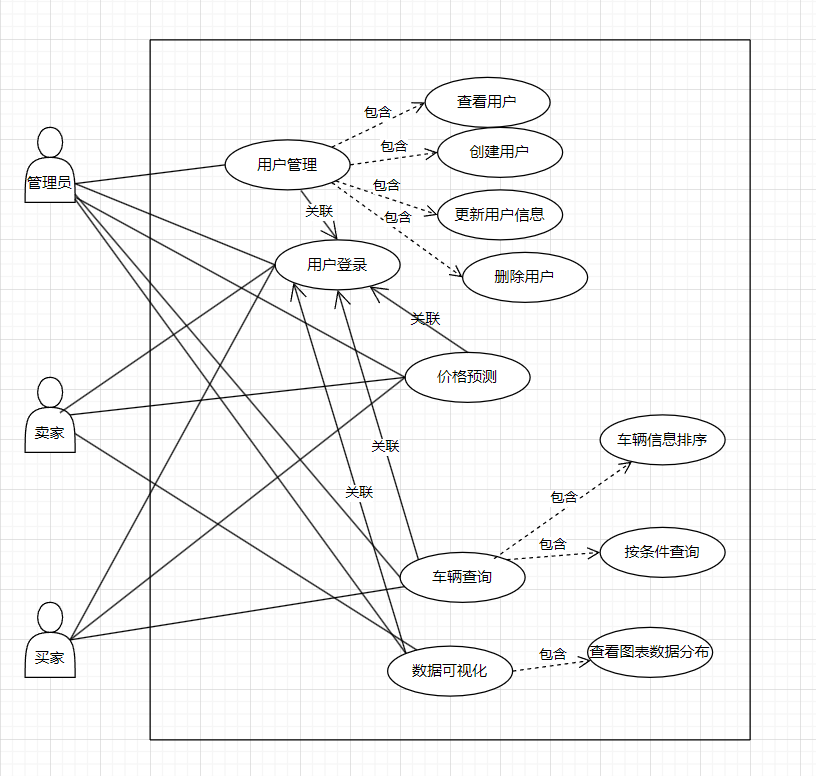
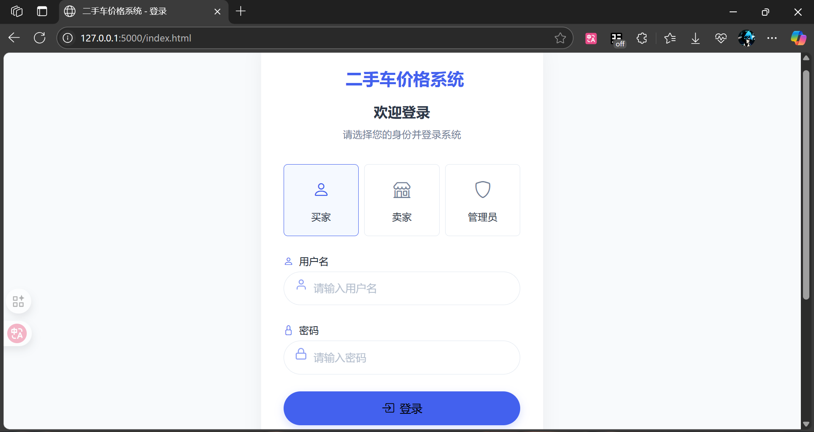
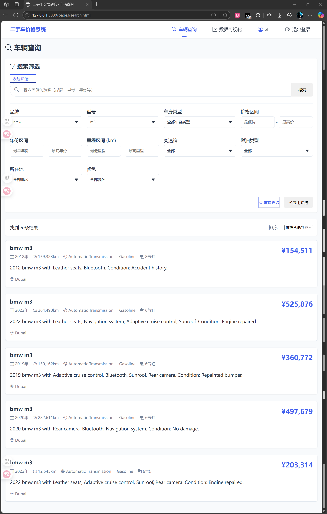
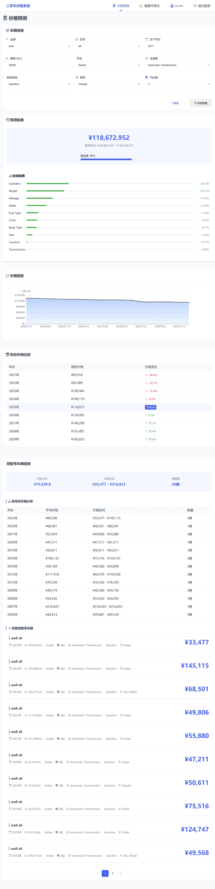
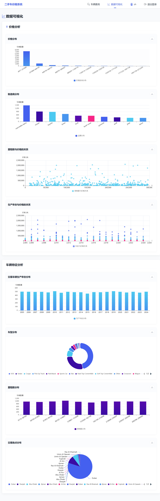
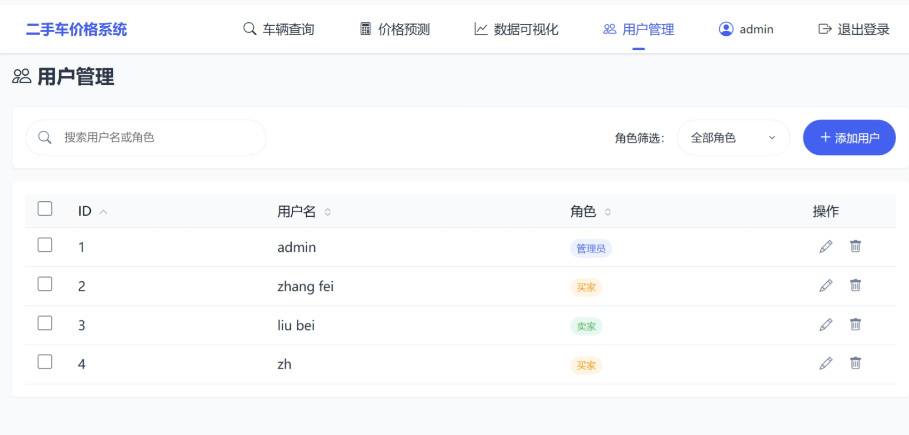

# 二手车价格系统后端

这是二手车价格系统的后端API服务，基于Flask开发，提供车辆信息查询、用户管理和价格预测等功能。

## 功能展示








## 功能模块


### 1. 查询车辆信息API

#### 获取车辆列表
- **接口地址**：`GET /api/v1/cars`
- **功能**：获取车辆列表，支持分页和多条件筛选
- **参数**：
  - `page`：页码，默认1
  - `limit`：每页数量，默认10
  - `make`：品牌
  - `model`：型号
  - `year_min`：最小年份
  - `year_max`：最大年份
  - `price_min`：最低价格
  - `price_max`：最高价格
  - `mileage_min`：最低里程
  - `mileage_max`：最高里程
  - `body_type`：车身类型
  - `fuel_type`：燃油类型
  - `transmission`：变速箱类型
  - `color`：颜色
  - `location`：地点
- **返回示例**：
```json
{
  "status": "success",
  "data": {
    "cars": [
      {
        "id": 1,
        "Make": "bentley",
        "Model": "bentayga",
        "Year": 2006,
        "Price": 639348,
        "Mileage": 217852,
        "Body_Type": "SUV",
        "Cylinders": 12,
        "Transmission": "Automatic Transmission",
        "Fuel_Type": "Gasoline",
        "Color": "White",
        "Location": " Dubai",
        "Date": "2024-09-23",
        "Description": "2006 bentley bentayga with Navigation system, Rear camera. Condition: Minor scratches."
      }
    ],
    "total": 100,
    "page": 1,
    "total_pages": 10,
    "limit": 10
  }
}
```

#### 获取车辆详情
- **接口地址**：`GET /api/v1/cars/<car_id>`
- **功能**：获取指定ID的车辆详情
- **参数**：
  - `car_id`：车辆ID (URL路径参数)
- **返回示例**：
```json
{
  "status": "success",
  "data": {
    "car": {
      "id": 1,
      "Make": "bentley",
      "Model": "bentayga",
      "Year": 2006,
      "Price": 639348,
      "Mileage": 217852,
      "Body_Type": "SUV",
      "Cylinders": 12,
      "Transmission": "Automatic Transmission",
      "Fuel_Type": "Gasoline",
      "Color": "White",
      "Location": " Dubai",
      "Date": "2024-09-23",
      "Description": "2006 bentley bentayga with Navigation system, Rear camera. Condition: Minor scratches."
    }
  }
}
```

### 2. 用户管理API

#### 获取用户列表
- **接口地址**：`GET /api/v1/users`
- **功能**：获取用户列表，支持分页和按用户名搜索
- **参数**：
  - `page`：页码，默认1
  - `limit`：每页数量，默认10
  - `name`：用户名过滤条件
- **返回示例**：
```json
{
  "status": "success",
  "data": {
    "users": [
      {
        "id": 1,
        "name": "admin",
        "role": "0"
      },
      {
        "id": 2,
        "name": "zhang fei",
        "role": "1"
      }
    ],
    "total": 3,
    "page": 1,
    "total_pages": 1,
    "limit": 10
  }
}
```

#### 用户角色说明
- **角色类型**：
  - `0`：管理员 - 拥有系统所有权限
  - `1`：买家 - 可以查询和购买车辆
  - `2`：卖家 - 可以发布和管理车辆信息

#### 获取用户详情
- **接口地址**：`GET /api/v1/users/<user_id>`
- **功能**：获取指定ID的用户详情
- **参数**：
  - `user_id`：用户ID (URL路径参数)
- **返回示例**：
```json
{
  "status": "success",
  "data": {
    "user": {
      "id": 1,
      "name": "admin",
      "role": "0"
    }
  }
}
```

#### 创建用户
- **接口地址**：`POST /api/v1/users`
- **功能**：创建新用户
- **请求体**：
```json
{
  "name": "new_user",
  "password": "123456",
  "role": "1"
}
```
- **返回示例**：
```json
{
  "status": "success",
  "data": {
    "user": {
      "id": 4,
      "name": "new_user",
      "role": "1"
    },
    "message": "用户创建成功"
  }
}
```

#### 更新用户
- **接口地址**：`PUT /api/v1/users/<user_id>`
- **功能**：更新指定ID的用户信息
- **参数**：
  - `user_id`：用户ID (URL路径参数)
- **请求体**：
```json
{
  "name": "updated_name",
  "password": "new_password",
  "role": "2"
}
```
- **返回示例**：
```json
{
  "status": "success",
  "data": {
    "user": {
      "id": 4,
      "name": "updated_name",
      "role": "2"
    },
    "message": "用户信息更新成功"
  }
}
```

#### 删除用户
- **接口地址**：`DELETE /api/v1/users/<user_id>`
- **功能**：删除指定ID的用户
- **参数**：
  - `user_id`：用户ID (URL路径参数)
- **返回示例**：
```json
{
  "status": "success",
  "data": {
    "message": "用户删除成功"
  }
}
```

#### 用户登录
- **接口地址**：`POST /api/v1/login`
- **功能**：用户登录验证
- **请求体**：
```json
{
  "name": "admin",
  "password": "123456"
}
```
- **返回示例**：
```json
{
  "status": "success",
  "data": {
    "user": {
      "id": 1,
      "name": "admin",
      "role": "0"
    },
    "message": "登录成功"
  }
}
```

### 3. 价格预测API

- 基于已经训练好的模型对价格预测
- 预测结果返回

### 4. 数据可视化API

#### 获取所有可视化图表类型
- **接口地址**：`GET /api/v1/visualization/charts`
- **功能**：获取系统支持的所有可视化图表类型
- **参数**：无
- **返回示例**：
```json
{
  "status": "success",
  "data": {
    "chart_types": [
      "mileage_price_relation",
      "year_price_relation",
      "manufacturer_distribution",
      "transaction_time_distribution",
      "manufacturing_year_distribution",
      "price_distribution",
      "body_type_distribution",
      "cylinders_distribution",
      "transmission_distribution",
      "color_distribution",
      "fuel_type_distribution",
      "mileage_distribution",
      "location_distribution"
    ]
  }
}
```

#### 获取特定图表的可视化数据
- **接口地址**：`GET /api/v1/visualization/<chart_type>`
- **功能**：获取指定类型图表的数据
- **参数**：
  - `chart_type`：图表类型，必须是系统支持的类型之一（URL路径参数）
- **支持的图表类型**：
  1. `mileage_price_relation` - 里程数与价格的关系（散点图）
  2. `year_price_relation` - 生产年份与价格的关系（散点图）
  3. `manufacturer_distribution` - 制造商分布（柱状图）
  4. `transaction_time_distribution` - 交易时间分布（柱状图）
  5. `manufacturing_year_distribution` - 交易车辆生产年份分布（柱状图）
  6. `price_distribution` - 价格分布（柱状图）
  7. `body_type_distribution` - 车型分布（柱状图）
  8. `cylinders_distribution` - 气缸数量分布（饼图）
  9. `transmission_distribution` - 变速箱类型分布（饼图）
  10. `color_distribution` - 颜色分布（饼图）
  11. `fuel_type_distribution` - 燃油类型分布（饼图）
  12. `mileage_distribution` - 里程数分布（柱状图）
  13. `location_distribution` - 交易地点分布（饼图）
- **返回示例**（散点图）：
```json
{
  "status": "success",
  "data": {
    "chart_type": "scatter",
    "title": "里程数与价格的关系",
    "xAxis": {
      "title": "里程数 (km)",
      "type": "linear"
    },
    "yAxis": {
      "title": "价格 (¥)",
      "type": "linear"
    },
    "data": [
      {"Mileage": 50000, "Price": 250000},
      {"Mileage": 100000, "Price": 180000},
      {"Mileage": 30000, "Price": 320000}
    ]
  }
}
```
- **返回示例**（柱状图）：
```json
{
  "status": "success",
  "data": {
    "chart_type": "bar",
    "title": "制造商分布",
    "xAxis": {
      "title": "制造商",
      "type": "category"
    },
    "yAxis": {
      "title": "车辆数量",
      "type": "linear"
    },
    "data": [
      {"Make": "Toyota", "count": 120},
      {"Make": "Honda", "count": 95},
      {"Make": "Ford", "count": 82}
    ]
  }
}
```
- **返回示例**（饼图）：
```json
{
  "status": "success",
  "data": {
    "chart_type": "pie",
    "title": "燃油类型分布",
    "data": [
      {"Fuel_Type": "Gasoline", "count": 250},
      {"Fuel_Type": "Diesel", "count": 120},
      {"Fuel_Type": "Electric", "count": 30}
    ],
    "label_field": "Fuel_Type",
    "value_field": "count"
  }
}
```


## 技术栈

- Python 3.6
- Flask (Web框架)
- MySQL (数据库)
- scikit-learn (机器学习)
- pandas (数据处理)


## 安装与启动

1. 安装依赖
```bash
pip install -r requirements.txt
```

2. 启动服务
```bash
python app.py
```

服务将在 `http://localhost:5000` 上运行。


## 数据库结构

### 车辆信息表 (car_info)

| 字段名 | 类型 | 说明 |
| ------ | ---- | ---- |
| id | int | 主键 |
| Make | text | 品牌 |
| Model | text | 型号 |
| Year | bigint | 年份 |
| Price | bigint | 价格 |
| Mileage | bigint | 里程 |
| Body_Type | varchar(50) | 车身类型 |
| Cylinders | bigint | 气缸数 |
| Transmission | text | 变速箱 |
| Fuel_Type | varchar(50) | 燃油类型 |
| Color | text | 颜色 |
| Location | text | 地点 |
| Date | text | 日期 |
| Description | text | 描述 |
| Make_encoded | bigint | 品牌编码 |
| Body_Type_encoded | varchar(50) | 车身类型编码 |
| Transmission_encoded | bigint | 变速箱编码 |
| Fuel_Type_encoded | varchar(50) | 燃油类型编码 |
| Color_encoded | bigint | 颜色编码 |
| Location_encoded | bigint | 地点编码 |
| Model_encoded | bigint | 型号编码 |


### 用户信息表 (user_info)

| 字段名 | 类型 | 说明 |
| ------ | ---- | ---- |
| id | int | 主键 |
| name | varchar(50) | 用户名 |
| password | varchar(50) | 密码 |
| role | varchar(50) | 角色 |


## 开发计划

- [x] 车辆信息查询API开发
- [x] 数据可视化API开发
- [x] 数据库连接
- [ ] 用户登录
- [ ] 价格预测模型集成
- [ ] API权限控制
